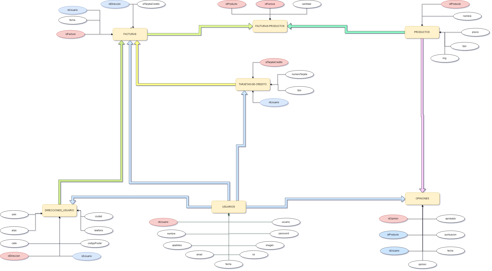

# Proyecto final

# Changelog

## Base de datos
Se han añadido multiples cambios:
- Se modifica la regla de actualización y eliminación.
- Se añade un nuevo campo llamado *cantidad* en la tabla Facturas-productos.
- Se añaden dos nuevas tablas llamadas *tarjetas-de-credito* y *direcciones-usuario*.
	- En la  tabla *tarjetas-de-credito* se almacenarán las tarjetas de créditos de los usuarios.
	- En la tabla *direcciones-usuario* se almacenarán las direcciones de facturación de los usuarios.
- Se añade un nuevo campo llamado *aprobación* en la tabla *opiniones*. Dicho campo será utilizado por el administrador para evitar comentarios indeseados.

## Panel de usuario
Se han añadido un nuevo panel de control para los datos más relevantes de cada usuario.

### Acciones del panel
Desde dicho panel se podrá realizar las siguientes acciones:
* Cambiar datos e imagen de perfil.
* Ver, eliminar y editar las opiniones que han realizado sobre los productos.
* Ver, crear y eliminar tarjetas de crédito.
* Ver, crear y eliminar direcciones de facturación.
* Ver las facturas realizadas.

## Checkout y realización de la compra
### Checkout
Se ha añadido una nueva vista llamada *checkout* desde la que podremos ver, editar o eliminar los productos que tenemos en el carrito en ese mismo momento.

### Realización de la compra
Se ha añadido una nueva página desde la que se efectuará el proceso de compra.
Para realizar dicho proceso será necesario que el usuario haya registrado al menos **una tarjeta de crédito y un domicilio de facturación**.
### Sistema de facturación
El sistema de facturación ha sido modificado. Ahora se genera un único registro para cada producto y se especifica la cantidad del mismo en el nuevo campo *cantidad*.

Tras realizar la compra se podrá visualizar la factura de la misma en el panel de usuarios.
## Panel de administación
Se ha añadido una nueva vista exclusiva para los usuarios administradores de la plataforma.
Desde esta vista podremos:
* Editar, añadir, eliminar o visualizar un producto.
* Editar o eliminar un usuario existente en la plataforma.
* Aprobar, editar o eliminar opiniones de los usuarios sobre los productos.

## Jquery.ui
Se han añadido formularios modales emergente en diferentes páginas:
- **Panel de usuario**
	* Modal para añadir y eliminar una nueva tarjeta de crédito.
	* Modal para añadir y eliminar una nueva dirección de facturación.
	* Modal para editar y eliminar un comentario.
- **Panel de administración**
	* Modal para confirmar la eliminación de productos, usuarios y comentarios.

## AJAX & JQUERY
Se han añadido varios scripts *AJAX* para el envío de datos:
- Checkout
	* Esta nueva vista tiene interacción con un script que actualiza la información los productos en carrito por **background**.
- Panel de administración
	* En la vista de comentarios podremos aprobar un comentario inmediatamente, sin necesidad de recargar la página.
- Productos
	* En la vista general de los productos podremos seguir cargando productos al hacer click en el botón *mostrar más*. Tras comprobar que no existen más elementos se bloquea el botón.
- Producto(único producto)
	* En esta vista podremos hacer uso de un paginador de comentarios.

Se han añadido varios scripts *JQUERY*:
- Todos los modales JQUERY.UI
	* En todos los modales se les edita un campo input para poder realizar posteriormente la consulta SQL.
- Panel de usuario
	* El menú de botones que que aparece interactua con un script Jqueyr que modifica la URL.

